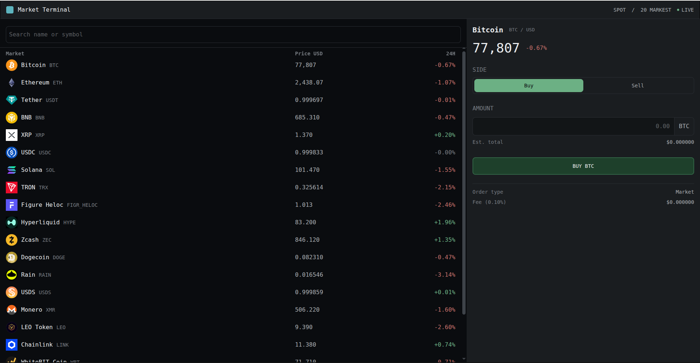

# Realtime Market Dashboard

A cryptocurrency market terminal built with React and TypeScript. Browse live market data, search across the list, and place a mock order from the side panel.

**[Live demo →](https://realtime-market-dashboard-eta.vercel.app/)**



---

## Why I built this

I build real-time trading interfaces professionally, mostly in Vue. This project is the same class of problem in React: a list that updates constantly, a search box that has to stay responsive while it does, and an order panel that shouldn't re-render every time an unrelated price ticks.

The feature set is small on purpose. The interesting part is what happens when the data starts moving.

---

## The performance problem

Prices update every 200ms. The first implementation held them in `CoinsList` state and passed each row its price as a prop — the obvious approach, and the wrong one.

Profiling a live session showed why:

| | |
|---|---|
| Commits recorded | 105 |
| Rows re-rendered per commit | **all 20** |
| Render time per commit | **31.9ms** |
| Cause reported by React | `CoinsList` |

Only **one** coin's price changes per tick, so 19 of those 20 renders did nothing. The number that matters is the render time: a 60fps frame budget is 16.7ms, and each price tick was taking roughly **twice that**. That's the lag you could feel when typing in the search box while prices ticked.

[See the naive implementation →](https://github.com/zahra-hanifi/realtime-market-dashboard/commit/e14b845)

## What fixed it

**Moving prices into a Zustand store, with each row subscribing to its own key.**

```ts
// CoinRow — subscribes to one key, not the whole store
const livePrice = usePriceStore((s) => s.prices[coin.id])
```

`CoinsList` no longer holds price state, so it doesn't re-render on a tick. The update goes straight to the one row whose price changed.

| | Before | After |
|---|---|---|
| Rows re-rendered per commit | 20 | **1** |
| Render time per commit | 31.9ms | **0.7ms** |
| Cause reported by React | `CoinsList` | the row itself |

From roughly twice the frame budget to a small fraction of it.

[See the fix →](https://github.com/zahra-hanifi/realtime-market-dashboard/commit/1334a2e)

### The order panel gets the same treatment

The panel displays the selected coin's price, so it needs live updates too — but only for *that* coin. It subscribes by key like the rows do:

```ts
const livePrice = usePriceStore((s) => s.prices[coinId])
```

Confirmed in the profiler: a `binancecoin` tick with Bitcoin selected leaves the panel untouched. It re-renders only when the coin it's actually displaying moves.

### What didn't help: `React.memo`

I also wrapped `CoinRow` in `memo`, expecting a further gain. Measured before and after: **no change.**

The reason is worth stating plainly. `memo` prevents a component re-rendering because its *parent* re-rendered. Once prices moved into the store, the parent stopped re-rendering on ticks — so there was nothing left for `memo` to prevent.

I kept it as a guard: if someone later adds state to `CoinsTable`, `memo` stops that cascading into 20 row renders. But the actual win came from moving state to where it's consumed, not from memoisation.

---

## Notes on the build

### Data fetching and cleanup

The coin request runs in an effect with an `AbortController` wired into the cleanup function, so an in-flight request is cancelled when the component unmounts or the effect re-runs. That covers two things at once: no state updates against an unmounted component, and no chance of a slow earlier response landing after a newer one.

Retry works by bumping a `reloadKey` held in state, which sits in the effect's dependency array — a small trick that avoids duplicating the fetch logic in an event handler.

The price feed follows the same discipline: `usePriceFeed` returns `clearInterval` from its effect, so the timer dies with the component.

### Debounced search

The input is controlled, but filtering runs off a debounced value so typing stays smooth. The debounce lives in a `useDebounce` hook rather than inline, and clears its timer on cleanup — without that, fast typing leaves a trail of pending timeouts that all eventually fire.

### Design tokens

Colour, spacing, and typography are defined once as Tailwind v4 `@theme` tokens in `index.css`, using `oklch` for perceptually even lightness steps. Components reference token names — `bg-bg-1`, `text-pos` — never raw hex.

The point is a single source of truth: changing the palette means editing one block, not hunting through components.

### Component variants as unions

`Button` takes `variant` and `size` as union types mapped through a `Record<Variant, string>`. Adding a variant to the union without adding its class is a compile error, not a silently unstyled button.

### Number formatting

Prices span five orders of magnitude — a coin at \$76,000 and one at \$0.016 sit in the same column — so `formatPrice` picks precision by magnitude rather than using one fixed setting. Numeric columns use tabular figures so digits don't shift width as prices tick.

Null handling is explicit rather than truthy: a 24h change of exactly `0.00%` is real data, and `??` is used over `||` when falling back to a price, since `0` is a legitimate value. A genuinely missing change renders an em dash rather than a bare `%`.

### Responsive behaviour

Desktop shows the order panel as a fixed sidebar. Mobile moves it into a native `<dialog>`, which brings focus trapping and escape-to-close for free instead of reimplementing them. The dialog animates with `@starting-style` and `allow-discrete`, so it transitions in and out without JavaScript, and respects `prefers-reduced-motion`.

---

## Tech stack

| | |
|---|---|
| Framework | React 19, TypeScript |
| Build | Vite |
| Styling | Tailwind CSS v4 (`@theme` tokens) |
| State | Zustand |
| Data source | CoinGecko public API |
| Tooling | ESLint, Prettier |

---

## Structure

```
src/
  api/          CoinGecko client and shared types
  components/   CoinsList, CoinsTable, CoinRow, OrderForm, Modal, Button
  hooks/        useDebounce, useMediaQuery, usePriceFeed
  store/        order state and price state (Zustand)
  utils/        number formatting
  index.css     design tokens
```

---

## Running locally

```bash
npm install
npm run dev          # http://localhost:5173
```

```bash
npm run build
npm run lint
npm run format
```

---

## What I'd do differently

- **The price feed is simulated.** `setInterval` stands in for a WebSocket. The rendering problem it creates is the same, but reconnection, message ordering, and gap recovery are all missing.
- **Updates aren't batched.** At a 200ms tick, render cost is already under a millisecond, so buffering updates into windows wouldn't measurably help here. A real feed at 20ms would need it.
- **No tests.** `formatPrice` and the order total calculation are pure functions with real edge cases, and are exactly what unit tests are for.
- **Orders are mock only.** The form calculates a total and fee but doesn't submit anywhere.
- **The list isn't virtualised.** Fine at 20 rows; a full market listing would need windowing.
- **No caching layer.** Every mount refetches — there's no stale-while-revalidate behaviour.

---

## License

MIT
